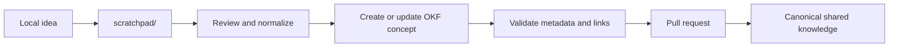
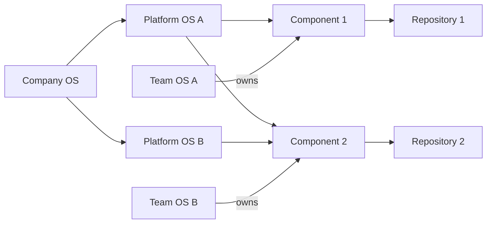
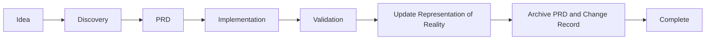

# Federated Company, Platform, and Team Operating System

**Documentation standard: Google Open Knowledge Format (OKF) v0.1**

## What We Want to Achieve

The goal is to create a practical, Git-based operating system for companies, platforms, and teams that works for humans and AI tools without forcing everything into one repository.

The system should:

- Keep company and platform knowledge independent from team operating practices.
- Let teams work across multiple platforms and repositories.
- Define the current **representation of reality** without forcing agents to read every historical PRD.
- Preserve completed PRDs and decisions for reference without treating them as current truth.
- Resolve the governance requirements that apply to a team based on the components it owns or changes.
- Use Google’s Open Knowledge Format (OKF) as the shared documentation contract.
- Work with Markdown, GitHub, VS Code, AI agents, and Obsidian.
- Support a unified knowledge graph without merging all repositories into one Git repository.
- Avoid user-specific absolute paths in committed configuration.

The central idea is:

> Platforms define what must be true. Teams define how they work. Components connect them.

---

# 1. OKF Knowledge Bundles and Local Scratchpads

Every Company OS, Platform OS, and Team OS repository should be an **OKF Knowledge Bundle**: a portable collection of Markdown concepts with YAML frontmatter, indexes, references, and an append-only knowledge log.

The canonical bundle contains only reviewed, shared knowledge:

```text
<os-repository>/
├── index.md
├── log.md
├── concepts/
├── standards/
├── requirements/
├── references/
├── templates/
├── scratchpad/             # Local-only, ignored by Git
│   ├── README.md           # Optional ignored local instructions
│   ├── drafts/
│   ├── brainstorms/
│   ├── personal-rules/
│   ├── experiments/
│   └── inbox/
└── .gitignore
```

The `scratchpad/` directory is deliberately **outside the canonical OKF knowledge bundle**, even though it may contain Markdown and OKF-like drafts. It is a private working area for one user or one local AI session.

It can contain:

- Unstructured brainstorming
- Early drafts
- Personal prompts or rules
- Temporary research notes
- Alternative structures
- Experimental concepts
- Notes that only one user understands
- Content waiting to be promoted into canonical documentation

It must not be used as:

- An authoritative source
- Shared governance
- Platform reality
- Team policy
- Evidence of compliance
- A dependency for CI or other users
- Default context for agents working from the repository

## Canonical knowledge versus scratchpad

| Area | Shared | Committed | Authoritative | Loaded by default |
|---|---:|---:|---:|---:|
| OKF bundle content | Yes | Yes | When marked canonical | Yes |
| Historical archive | Yes | Yes | No, reference only | No |
| `scratchpad/` | No | No | No | No |

## Promotion workflow

Content moves from private exploration to shared knowledge only through an explicit promotion step:



Promotion should:

1. Identify the authoritative destination.
2. Convert the content into a valid OKF concept.
3. Add required metadata and stable references.
4. Remove personal assumptions and machine-specific paths.
5. Link related concepts.
6. Update `index.md`.
7. Append the change to `log.md`.
8. Submit the change through normal review.

## Git ignore rules

Every OS repository should commit this rule:

```gitignore
# Local user and AI working area
scratchpad/
.scratchpad/

# Local configuration and environment
.company-os.local.yaml
.env
.env.local
```

The repository may commit a reusable example outside the ignored directory:

```text
scratchpad.example/
├── README.md
├── drafts/
├── brainstorms/
├── personal-rules/
├── experiments/
└── inbox/
```

A setup command can copy it locally:

```bash
cp -R scratchpad.example scratchpad
```

Alternatively, the CLI can initialize it:

```bash
company-os scratchpad init
```

## Agent behavior

Agents must follow these rules:

```yaml
scratchpad:
  path: scratchpad
  tracked: false
  authority: none
  includeInDefaultContext: false
  allowDrafting: true
  requireExplicitPromotion: true
```

An agent may write drafts to the scratchpad when requested, but it must not silently treat that content as company, platform, or team truth.

## Minimum OKF concept

Each canonical concept is one UTF-8 Markdown file with YAML frontmatter:

```markdown
---
type: Platform Component
title: Customer Notification Service
description: Delivers governed outbound customer notifications.
resource: component://customer-notification-service
tags:
  - type/component
  - platform/communications
timestamp: 2026-07-18T12:00:00Z

# Producer-defined extensions
status: active
authority: canonical
owner: team://customer-engagement
repository: repo://customer-notification-service
---

# Purpose

Describe the current component purpose and behavior.
```

OKF permits producer-defined metadata extensions. Consumers should preserve unknown fields rather than reject the document. The OS conventions add fields such as `status`, `authority`, `owner`, `scope`, and stable relationship identifiers.

---

# 3. Core Model

The architecture is not a hierarchy where teams belong to one platform.

It is a federated, many-to-many model:

```text
Company standards
        │
        ▼
Platform requirements
        │
        ▼
Components
        ▲
        │
Team ownership and implementation
```

A team may own components across several platforms.

A platform may contain or interact with components owned by several teams.

The component is the join point between:

- Company governance
- Platform governance
- Platform capabilities
- Teams
- Git repositories
- Technical documentation
- Current implementation
- Historical change records



---

# 3. The Three Independent Operating Systems

## 2.1 Company OS

The Company OS defines organization-wide requirements and shared language.

It may include:

- Enterprise policies
- Security baselines
- Privacy requirements
- Regulatory controls
- Accessibility requirements
- Architecture principles
- Technology standards
- Documentation standards
- Risk classifications
- Enterprise taxonomy
- Common templates
- Minimum governance controls

It should not define how every team plans a sprint or organizes refinement.

```text
company-os/
├── README.md
├── company.yaml
├── governance/
├── policies/
├── standards/
├── controls/
├── taxonomy/
├── templates/
├── registries/
├── scratchpad/                 # Local-only; ignored by Git
└── archive/
```

---

## 2.2 Platform OS

A Platform OS defines the authoritative representation of one platform.

It owns:

- Platform purpose
- Platform capabilities
- Current platform behavior
- Business rules
- Platform architecture
- Platform components
- Supported integrations
- APIs and events
- Platform-specific governance
- Platform-specific standards
- Operational expectations
- Current constraints
- Lifecycle information
- Current ownership references

It should not define the internal operating model of every team that contributes to it.

```text
platform-os-communications/
├── README.md
├── platform.yaml
├── glossary.md
│
├── reality/
│   ├── platform-overview.md
│   ├── capabilities/
│   ├── domains/
│   ├── journeys/
│   ├── business-rules/
│   ├── data/
│   ├── integrations/
│   ├── security/
│   ├── reliability/
│   └── limitations/
│
├── components/
│   ├── component-catalog.yaml
│   ├── services/
│   ├── applications/
│   ├── libraries/
│   ├── events/
│   └── data-products/
│
├── architecture/
│   ├── system-context.md
│   ├── container-view.md
│   ├── integration-map.md
│   ├── dependency-rules.md
│   └── reference-architectures/
│
├── governance/
│   ├── requirements.yaml
│   ├── required-controls.md
│   ├── security-requirements.md
│   ├── privacy-requirements.md
│   ├── observability-requirements.md
│   ├── release-requirements.md
│   └── exception-process.md
│
├── standards/
│   ├── api-standards.md
│   ├── event-standards.md
│   ├── data-standards.md
│   ├── naming-standards.md
│   ├── lifecycle-standards.md
│   └── documentation-standards.md
│
├── decisions/
│   ├── active/
│   ├── superseded/
│   └── index.yaml
│
├── change-records/
│   ├── active/
│   ├── completed/
│   └── index.yaml
│
├── archive/
│   ├── prds/
│   ├── retired-components/
│   ├── superseded-rules/
│   └── deprecated-architecture/
│
├── scratchpad/                 # Local-only; ignored by Git
└── config/
    ├── repositories.yaml
    └── workspace.yaml
```

Each important platform may have its own repository:

```text
platform-os-identity
platform-os-payments
platform-os-communications
platform-os-customer-experience
platform-os-data
```

---

## 2.3 Team OS

The Team OS defines how one team operates.

It owns:

- Team charter
- Responsibilities
- Team roles
- Planning workflow
- Sprint planning
- Backlog management
- Definition of Ready
- Definition of Done
- Estimation rules
- Review practices
- Incident workflow
- Release workflow
- Team-specific templates
- Team-specific checklists
- Repository ownership
- Component ownership
- AI-agent instructions
- Escalation and decision practices

```text
team-os-customer-engagement/
├── README.md
├── team.yaml
│
├── team/
│   ├── charter.md
│   ├── responsibilities.md
│   ├── ownership.md
│   ├── stakeholders.md
│   └── repository-map.md
│
├── operating-model/
│   ├── delivery-lifecycle.md
│   ├── sprint-planning.md
│   ├── backlog-management.md
│   ├── estimation.md
│   ├── incident-response.md
│   ├── release-process.md
│   └── decision-process.md
│
├── standards/
│   ├── definition-of-ready.md
│   ├── definition-of-done.md
│   ├── engineering-standards.md
│   ├── product-standards.md
│   ├── testing-standards.md
│   ├── observability-standards.md
│   └── documentation-standards.md
│
├── templates/
│   ├── prd-template.md
│   ├── feature-spec-template.md
│   ├── technical-design-template.md
│   ├── adr-template.md
│   ├── spike-template.md
│   ├── incident-review-template.md
│   ├── release-readiness-template.md
│   └── sprint-goal-template.md
│
├── checklists/
│   ├── story-readiness.md
│   ├── pull-request.md
│   ├── security-review.md
│   ├── production-readiness.md
│   ├── accessibility.md
│   └── release.md
│
├── workflows/
│   ├── feature-delivery.md
│   ├── bug-fix.md
│   ├── emergency-change.md
│   ├── architecture-change.md
│   └── deprecation.md
│
├── ownership/
│   ├── components.yaml
│   └── repositories.yaml
│
├── integrations/
│   ├── platforms.yaml
│   └── company-os.yaml
│
├── generated/
│   └── effective-governance.yaml
│
├── scratchpad/                 # Local-only; ignored by Git
│
└── archive/
    ├── completed-initiatives/
    └── retired-processes/
```

The Team OS references platform and company requirements. It does not duplicate them.

---

# 4. Representation of Reality vs. Historical Change

The Platform OS should not become a storage location for every PRD, plan, and decision ever created.

It should distinguish between:

| Information type | Purpose | Loaded by default |
|---|---|---:|
| Representation of reality | What is true now | Yes |
| Operating model | How work is performed | When relevant |
| Historical change records | Why reality changed | On demand |

A useful analogy is:

```text
Representation of Reality = Account balance
PRDs, ADRs, change packages = Transactions
```

The transactions explain how the balance changed, but the balance is what should be used to understand the current state.

## Change lifecycle



A change is not fully done until:

- The implementation is complete.
- The relevant platform reality documents are updated.
- The component catalog is updated when needed.
- The PRD or change package is archived.
- The historical record links to the new representation of reality.

---

# 5. The Component as the Join Entity

The component is the primary connection between platforms and teams.

```text
Platform
   ▲
   │ belongs to / supports / interacts with
   │
Component
   │
   ├── owned by ──────────> Team
   ├── implemented in ────> Repository
   ├── governed by ───────> Company controls
   └── constrained by ────> Platform standards
```

A component may:

- Belong to one platform.
- Support another platform.
- Integrate with several platforms.
- Be owned by one team.
- Be maintained by more than one team.
- Be implemented in one or several repositories.

## Example component descriptor

```yaml
schemaVersion: "1.0"
kind: Component

metadata:
  id: customer-notification-service
  name: Customer Notification Service
  status: active

ownership:
  accountableTeam: team://customer-engagement
  maintainers:
    - team://customer-engagement
  repository: repo://customer-notification-service

platformRelationships:
  - platform: platform://communications
    relationship: belongs-to
    capabilities:
      - capability://communications/message-delivery

  - platform: platform://customer-experience
    relationship: supports
    capabilities:
      - capability://customer-experience/proactive-notifications

companyGovernance:
  inherits:
    - company-policy://security/service-baseline
    - company-policy://privacy/customer-data
    - company-standard://observability/tier-1

platformGovernance:
  inherits:
    - platform-standard://communications/delivery-reliability
    - platform-standard://communications/message-schema
    - platform-standard://customer-experience/customer-consent

documentation:
  platformReality:
    - platform://communications/components/customer-notification-service
  repositoryArchitecture:
    - repo://customer-notification-service/docs/architecture.md
```

---

# 6. Repository Model

These operating systems should normally be persisted in separate Git repositories.

```text
github.com/company/company-os

github.com/company/platform-os-identity
github.com/company/platform-os-payments
github.com/company/platform-os-communications

github.com/company/team-os-customer-engagement
github.com/company/team-os-account-servicing

github.com/company/customer-notification-service
github.com/company/customer-profile-api
github.com/company/payment-orchestrator
```

Each repository has a different owner and lifecycle.

| Repository | Primary owner | Typical change frequency |
|---|---|---:|
| Company OS | Enterprise governance groups | Low to medium |
| Platform OS | Platform owners and architects | Medium |
| Team OS | The individual team | Medium to high |
| Component repository | Engineering team | High |

The repositories remain independent but are connected using stable identifiers and registries.

---

# 7. Stable Identifiers

Do not depend only on relative paths between repositories.

Use logical identifiers:

```text
company-policy://security/service-baseline
platform://communications
platform-standard://communications/message-schema
team://customer-engagement
component://customer-notification-service
repo://customer-notification-service
capability://communications/message-delivery
prd://2026/delegated-account-access
```

These identifiers do not need to be internet protocols. They are stable references that tooling can resolve.

Example in Markdown:

```markdown
Owned by [[Customer Engagement Team]].

Canonical team ID: `team://customer-engagement`

Implemented in:
`repo://customer-notification-service`

Governed by:
`platform-standard://communications/message-schema`
```

---

# 8. Platform Requirements

Each Platform OS should expose machine-readable requirements.

```yaml
schemaVersion: "1.0"
kind: PlatformRequirements

platform:
  id: communications

requirements:
  - id: delivery-reliability
    title: Message Delivery Reliability
    level: mandatory

    appliesTo:
      componentTypes:
        - service
        - worker
      relationships:
        - belongs-to
        - publishes-to

    requirement: >
      Components delivering customer messages must implement retry,
      deduplication, delivery status tracking, and dead-letter handling.

    verification:
      evidence:
        - architecture-document
        - integration-tests
        - operational-dashboard

      checklist:
        - Retry strategy is documented
        - Idempotency is implemented
        - Failed messages are recoverable
        - Delivery status is observable

  - id: message-schema
    title: Standard Message Envelope
    level: mandatory

    appliesTo:
      interfaces:
        - event
        - queue-message

    requirement: >
      Messages must use the current platform message envelope.
```

The platform defines what must be satisfied.

The team defines how it is satisfied.

---

# 9. Team Ownership Registry

The Team OS should declare the components and repositories the team owns or maintains.

## `ownership/components.yaml`

```yaml
schemaVersion: "1.0"

team:
  id: customer-engagement
  name: Customer Engagement

components:
  - id: customer-notification-service
    relationship: accountable
    repository: repo://customer-notification-service

  - id: customer-preferences-api
    relationship: accountable
    repository: repo://customer-preferences-api

  - id: message-template-ui
    relationship: maintainer
    repository: repo://message-template-ui
```

The applicable platform requirements are resolved through those components.

```text
Team ownership
      │
      ▼
Owned or changed components
      │
      ▼
Platform relationships
      │
      ▼
Company and platform requirements
      │
      ▼
Effective governance
```

---

# 10. Effective Governance

For a component, the effective requirements are composed from several sources:

```text
Company baseline
    +
Platform A requirements
    +
Platform B requirements
    +
Component-specific controls
    +
Team implementation practices
    =
Effective requirements
```

The Team OS can generate:

```text
generated/effective-governance.yaml
```

Example:

```yaml
generatedAt: 2026-07-18T12:00:00Z
team: customer-engagement

components:
  customer-notification-service:
    platforms:
      - communications
      - customer-experience

    requirements:
      company:
        - security-service-baseline
        - customer-data-privacy
        - tier-1-observability

      platform:
        communications:
          - delivery-reliability
          - message-schema

        customer-experience:
          - consent-validation
          - customer-preference-enforcement
```

This file should be generated, not manually maintained.

It can support:

- Sprint planning
- PRD generation
- Definition of Ready checks
- Definition of Done checks
- Pull request validation
- Architecture reviews
- Release gates
- AI-agent context selection
- Governance evidence collection

---

# 11. Composable Definition of Ready and Definition of Done

The Team OS owns its Definition of Ready and Definition of Done.

However, each should have two layers.

## Team baseline

```markdown
## Team Definition of Ready

- The problem and expected outcome are clear.
- The affected repositories and components are identified.
- Dependencies are known.
- Acceptance criteria are testable.
- The work is small enough to execute.
```

## Dynamically applicable governance

```markdown
## Platform and Governance Readiness

- Applicable platforms have been resolved.
- Mandatory platform requirements have been identified.
- Governance impact has been evaluated.
- Required architecture, security, privacy, or risk reviews are known.
- Required completion evidence has been defined.
```

Definition of Done:

```markdown
## Team Definition of Done

- Implementation is complete.
- Tests pass.
- Peer review is complete.
- Operational documentation is updated.
- Relevant Representation of Reality documents are updated.

## Applicable Governance Completion

- Company controls are satisfied.
- Platform-specific requirements are satisfied.
- Evidence is linked.
- Exceptions are documented and approved.
```

This avoids creating one enormous static checklist containing every possible platform requirement.

---

# 12. Authority Matrix

Each fact should have one authoritative owner.

| Information | Authoritative repository |
|---|---|
| Enterprise policy | Company OS |
| Company security baseline | Company OS |
| Platform capabilities | Platform OS |
| Platform business rules | Platform OS |
| Platform component catalog | Platform OS |
| Platform-specific standards | Platform OS |
| Team workflow | Team OS |
| Team Definition of Ready and Done | Team OS |
| Team repository ownership | Team OS or enterprise registry |
| Component implementation | Component repository |
| Component technical architecture | Component repository |
| Component-to-platform relationship | Platform OS, confirmed by component metadata |
| Historical PRD | Platform archive or dedicated archive |
| Current platform behavior | Platform OS reality |
| Current source-code behavior | Component repository |

References may exist in several repositories, but each type of information should have one authoritative source.

---

# 13. Portable Local Path Configuration

Committed configuration must never contain developer-specific absolute paths.

The shared configuration should store:

- Stable repository IDs
- Git remote URLs
- Relative checkout directories
- Environment-variable references

Local configuration should store:

- Absolute filesystem paths
- Workspace selection
- User-specific overrides
- Obsidian vault location

## Recommended precedence

```text
CLI arguments
    >
Environment variables
    >
Repository-local ignored config
    >
User-level config
    >
Committed shared config
    >
Built-in defaults
```

---

# 14. Shared Repository Configuration

## `config/repositories.yaml`

```yaml
schemaVersion: "1.0"

workspace:
  rootVariable: COMPANY_OS_WORKSPACE_ROOT
  defaultDirectory: company-workspace

repositories:
  - id: company-os
    type: company-os
    remote: git@github.com:company/company-os.git
    directory: company-os

  - id: platform-os-communications
    type: platform-os
    remote: git@github.com:company/platform-os-communications.git
    directory: platforms/communications

  - id: platform-os-customer-experience
    type: platform-os
    remote: git@github.com:company/platform-os-customer-experience.git
    directory: platforms/customer-experience

  - id: team-os-customer-engagement
    type: team-os
    remote: git@github.com:company/team-os-customer-engagement.git
    directory: teams/customer-engagement

  - id: customer-notification-service
    type: component
    remote: git@github.com:company/customer-notification-service.git
    directory: components/customer-notification-service
```

The effective path is derived as:

```text
localPath = workspace.root + repository.directory
```

Example:

```text
${COMPANY_OS_WORKSPACE_ROOT}/platforms/communications
${COMPANY_OS_WORKSPACE_ROOT}/teams/customer-engagement
${COMPANY_OS_WORKSPACE_ROOT}/components/customer-notification-service
```

---

# 15. Environment Variables

Recommended variables:

```text
COMPANY_OS_WORKSPACE_ROOT
COMPANY_OS_VAULT_ROOT
COMPANY_OS_CONFIG_FILE
COMPANY_OS_ACTIVE_WORKSPACE
COMPANY_OS_CACHE_ROOT
```

Examples:

```bash
export COMPANY_OS_WORKSPACE_ROOT=/Users/javier/work/company-knowledge
export COMPANY_OS_VAULT_ROOT=/Users/javier/Documents/CompanyKnowledge
export COMPANY_OS_ACTIVE_WORKSPACE=primary
```

Different users can use different roots:

```text
Javier:
/Users/javier/work/company-knowledge

Alice:
/Users/alice/projects/company

CI:
/workspace/company
```

The repository paths remain consistent relative to the configured root.

---

# 16. User-Level Configuration

A developer can maintain:

```text
~/.company-os/config.yaml
```

Example:

```yaml
activeWorkspace: primary

workspaces:
  primary:
    root: /Users/javier/work/company-knowledge
    vault: /Users/javier/Documents/CompanyKnowledge

  experimental:
    root: /Users/javier/work/company-experimental
    vault: /Users/javier/Documents/CompanyKnowledgeExperimental

git:
  protocol: ssh

repositories:
  customer-notification-service:
    localPath: /Users/javier/work/notification-experiments
```

The user-level file remains outside all project repositories.

---

# 17. Repository-Local Overrides

A repository may include a committed example:

```text
.company-os.local.example.yaml
```

Example:

```yaml
workspace:
  root: /absolute/path/to/company-workspace

repositories:
  customer-notification-service:
    localPath: /optional/custom/path
```

The user creates:

```text
.company-os.local.yaml
```

This file must be ignored:

```gitignore
.company-os.local.yaml
.env
.env.local
```

The repository may also commit:

```text
.env.example
```

```dotenv
COMPANY_OS_WORKSPACE_ROOT=/path/to/company-workspace
COMPANY_OS_VAULT_ROOT=/path/to/obsidian-vault
```

---

# 18. Resolved Configuration Example

Shared configuration:

```yaml
repositories:
  - id: platform-os-communications
    directory: platforms/communications

  - id: customer-notification-service
    directory: components/customer-notification-service
```

User configuration:

```yaml
workspace:
  root: /Users/javier/work/company-os
```

Local override:

```yaml
repositories:
  customer-notification-service:
    localPath: /Users/javier/work/notification-experiments
```

Resolved result:

```yaml
repositories:
  platform-os-communications:
    localPath: /Users/javier/work/company-os/platforms/communications

  customer-notification-service:
    localPath: /Users/javier/work/notification-experiments
```

The default convention is used unless a specific local override exists.

---

# 19. Obsidian Compatibility

Obsidian should be the graph and navigation layer, not the only source of truth.

Use standard Markdown first, with Obsidian-compatible enhancements:

- YAML frontmatter
- Wiki links
- Standard Markdown links where useful
- Stable IDs
- Controlled tags
- Small focused notes
- Portable file structures

Avoid:

- Critical information stored only in canvas files
- Heavy dependence on proprietary plugins
- Thousands of uncontrolled tags
- Using the graph as a replacement for indexes
- Embedding user-specific paths in notes

## Example frontmatter

```yaml
---
id: component-customer-notification-service
type: component
title: Customer Notification Service
status: active
authority: canonical
scope: platform
team: customer-engagement
repository: customer-notification-service
platforms:
  - communications
  - customer-experience
domains:
  - customer-communications
capabilities:
  - message-delivery
  - proactive-notifications
tags:
  - type/component
  - status/active
  - team/customer-engagement
  - platform/communications
  - platform/customer-experience
aliases:
  - Notification Service
updated: 2026-07-18
---
```

## Example note

```markdown
# Customer Notification Service

The Customer Notification Service delivers outbound customer communications.

## Relationships

- Owned by [[Customer Engagement Team]]
- Belongs to [[Communications Platform]]
- Supports [[Customer Experience Platform]]
- Implements [[Message Delivery]]
- Supports [[Proactive Notifications]]
- Governed by [[Customer Data Privacy Requirements]]

## Repository

`repo://customer-notification-service`

## Current behavior

The service supports templated notifications, delivery tracking, retries,
and customer preference enforcement.
```

---

# 20. Tag Taxonomy

Tags should classify notes.

Links should describe relationships.

Recommended namespaces:

```text
type/
status/
scope/
team/
platform/
domain/
capability/
component/
lifecycle/
risk/
governance/
```

Examples:

```text
#type/component
#type/business-rule
#type/capability
#status/active
#status/draft
#status/deprecated
#scope/company
#scope/platform
#scope/team
#platform/communications
#team/customer-engagement
#risk/high
#governance/pii
```

Use tags for classification:

```text
This note belongs to the communications platform.
```

Use links for relationships:

```text
This component implements this capability.
```

---

# 21. Unified Local Workspace

The repositories do not need to be merged into one Git repository.

They can be assembled locally under one parent directory:

```text
company-knowledge-workspace/
├── company-os/                   # Git repository
├── platforms/
│   ├── communications/           # Git repository
│   ├── customer-experience/      # Git repository
│   └── identity/                 # Git repository
├── teams/
│   ├── customer-engagement/      # Git repository
│   └── account-servicing/        # Git repository
├── components/
│   ├── notification-service/     # Git repository
│   └── customer-profile-api/     # Git repository
└── .obsidian/
```

The parent directory can be opened as one Obsidian vault.

Each child directory remains an independent Git repository.

---

# 22. Workspace Manifest

A workspace manifest can declare which repositories belong in a local workspace.

```yaml
schemaVersion: "1.0"

workspace:
  id: customer-engagement-workspace
  rootVariable: COMPANY_OS_WORKSPACE_ROOT

sources:
  company:
    repository: repo://company-os
    directory: company-os

  platforms:
    - repository: repo://platform-os-communications
      directory: platforms/communications

    - repository: repo://platform-os-customer-experience
      directory: platforms/customer-experience

  teams:
    - repository: repo://team-os-customer-engagement
      directory: teams/customer-engagement

  components:
    discoverFrom:
      - teams/customer-engagement/ownership/components.yaml

    directoryPattern: components/{componentId}
```

A CLI could support:

```bash
company-os workspace sync
company-os graph build
company-os governance resolve
company-os validate
company-os workspace use primary
```

---

# 23. Recommended Operating Rules

1. Company OS owns enterprise-wide requirements.
2. Platform OS owns platform truth, capability, governance, and component definitions.
3. Team OS owns how the team plans, builds, validates, and releases.
4. Components determine which platform requirements apply to a team.
5. Historical PRDs are archived and are not loaded by default.
6. The Representation of Reality is updated when changes are completed.
7. Stable identifiers connect repositories.
8. Relative checkout directories are committed.
9. Absolute local paths are configured by users.
10. Obsidian provides a unified graph, but Git repositories remain independent.
11. Generated governance files are derived, not manually maintained.
12. Every fact should have one authoritative owner.
13. Every OS repository may provide a Git-ignored `scratchpad/` for private drafts and personal rules.
14. Scratchpad content becomes shared knowledge only after explicit OKF promotion and review.

---

# 24. Final Architecture

```text
┌──────────────────────────────────────────────┐
│ COMPANY OS                                   │
│ Enterprise governance, standards, taxonomy   │
└──────────────────────────────────────────────┘
             ▲                       ▲
             │ referenced by         │ referenced by
             │                       │
┌────────────┴────────────┐  ┌───────┴──────────────┐
│ PLATFORM OS A           │  │ PLATFORM OS B        │
│ Reality                 │  │ Reality              │
│ Capabilities            │  │ Capabilities         │
│ Components              │  │ Components           │
│ Platform governance     │  │ Platform governance  │
└────────────▲────────────┘  └────────▲─────────────┘
             │                        │
             │ component relationship│
             └───────────┬────────────┘
                         │
                ┌────────▼─────────┐
                │ COMPONENT        │
                │ Stable ID        │
                │ Repository       │
                │ Platform links   │
                │ Owner team       │
                └────────▲─────────┘
                         │ ownership
                         │
                ┌────────┴─────────┐
                │ TEAM OS          │
                │ Planning         │
                │ DoR / DoD        │
                │ Workflows        │
                │ Team practices   │
                └──────────────────┘
```

The governing principle is:

> The Company OS defines shared enterprise requirements.  
> Each Platform OS defines its current reality and platform-specific requirements.  
> Each Team OS defines how the team works.  
> Components determine which company and platform requirements the team must satisfy.
