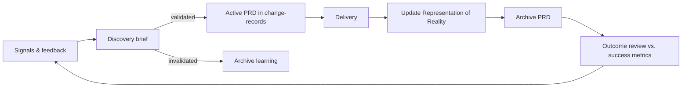

# Flexibility, Skills, and Role Views for the Federated OS

**Companion to:** Federated Company, Platform, and Team Operating System (OKF v0.1)
**Purpose:** Define how teams get flexibility without breaking the standard, how skills/commands/scripts guide users through the canonical process, and what the system looks like for each role.

---

# 1. The Flexibility Model: Freedom in the Frame

The core problem: if everything is mandatory, teams route around the system. If everything is optional, there is no standard. The fix is to classify every rule, standard, and process step into one of three tiers, and make the tier machine-readable.

## 1.1 Rule tiers

| Tier | Meaning | Team freedom | Verification |
|---|---|---|---|
| `mandatory` | Must be satisfied. Non-negotiable. | How to satisfy it, never whether | Automated or evidence-based |
| `default` | Comply-or-explain. Applies unless the team documents a deviation | Can deviate with a recorded rationale | Deviation manifest reviewed |
| `guidance` | Recommended practice | Fully free | None |

Every requirement in `governance/requirements.yaml` (platform) and every control in Company OS declares its tier:

```yaml
requirements:
  - id: delivery-reliability
    level: mandatory          # outcome must be met

  - id: prd-structure
    level: default            # use platform PRD structure unless you explain why not

  - id: estimation-method
    level: guidance           # teams choose freely
```

## 1.2 Outcomes, not implementations

Mandatory rules must be written as **verifiable outcomes**, never as prescribed implementations. This is the single most important drafting rule for preserving flexibility.

```yaml
# Good — outcome, team chooses the how
requirement: >
  Failed customer messages must be recoverable and delivery status
  must be observable.

# Bad — implementation, removes team autonomy for no governance benefit
requirement: >
  Use RabbitMQ with a dead-letter exchange named dlx.customer and
  Grafana dashboard template v3.
```

The `verification.checklist` and `verification.evidence` blocks define what "satisfied" looks like. The team's engineering standards define how they get there.

## 1.3 Team deviation manifest

A team that departs from a `default` rule records it once, in one place, in its Team OS:

```yaml
# team-os-.../governance/deviations.yaml
schemaVersion: "1.0"
team: customer-engagement

deviations:
  - rule: platform-standard://communications/prd-structure
    tier: default
    status: approved
    rationale: >
      Team uses a two-page lean PRD for changes under 2 weeks;
      full structure is used for larger initiatives.
    approvedBy: platform://communications
    reviewDate: 2027-01-15        # deviations expire and are re-reviewed

  - rule: company-standard://estimation/story-points
    tier: default
    status: declared              # guidance-adjacent defaults need no approval
    rationale: Team uses cycle-time forecasting instead of points.
```

Rules for deviations:

1. A deviation always references the exact rule ID it overrides — no silent divergence.
2. Deviations from `default` rules are declared; deviations that a platform marks as needing sign-off are approved by the rule owner.
3. `mandatory` rules cannot be deviated from — only formally excepted (below).
4. Every deviation has a `reviewDate`. Expired deviations surface in `company-os validate`.
5. The generated `effective-governance.yaml` merges deviations, so agents and checklists reflect the team's real, approved way of working.

## 1.4 Exceptions to mandatory rules

Exceptions exist, but they are loud, temporary, and owned:

```yaml
exceptions:
  - rule: platform-standard://communications/message-schema
    component: component://legacy-fax-gateway
    reason: Legacy protocol cannot carry the standard envelope.
    compensatingControls:
      - Manual delivery reconciliation report, daily
    owner: team://customer-engagement
    approvedBy: platform://communications
    expires: 2026-12-31
```

An exception without an expiry date is invalid. An expired exception fails validation.

## 1.5 The same model applies to platforms

Platforms are "teams" relative to the Company OS. A Platform OS:

- Must satisfy Company OS `mandatory` controls.
- Declares deviations from Company OS `default` standards in `platform-os-*/governance/deviations.yaml`.
- May **tighten** company rules for its domain, never weaken them (`mandatory` can only ratchet up).
- Declares a conformance profile so teams know what they inherit:

```yaml
# platform.yaml
conformance:
  companyOsVersion: "2026.2"
  profile: standard            # standard | strict | provisional
  tightens:
    - company-standard://observability/tier-2   # raised to tier-1 here
```

## 1.6 Versioned requirements (fixes the in-flight-work problem)

Requirements are versioned, and in-flight work pins the version it started against:

```yaml
requirements:
  - id: delivery-reliability
    version: "2.1"
    effectiveFrom: 2026-06-01
    supersedes: "2.0"
    migrationDeadline: 2026-12-01   # work bound to 2.0 must migrate by then
```

A PRD records `governanceSnapshot: 2026-07-18` at creation. Done-checks evaluate against that snapshot unless a rule change explicitly forces migration.

## 1.7 Single source of truth for component↔platform links (fixes the authority conflict)

The original proposal states the component–platform relationship in three places. Resolve it:

| Fact | Authoritative source | Everything else |
|---|---|---|
| Component ↔ platform relationships | The component descriptor (`component.yaml` in the Platform OS catalog entry) | Team ownership registry and platform catalog index are **generated/validated** against it |
| Component ↔ team ownership | Team OS `ownership/components.yaml` | Component descriptor's `ownership` block is validated against it |

`company-os validate` fails on any mismatch. Humans edit one file; tooling reconciles the rest.

---

# 2. Product Operating Model (the missing product layer)

## 2.1 Where product work lives

| Artifact | Location | Status values |
|---|---|---|
| Discovery brief | `team-os/.../product/discovery/` | draft → validated → promoted/killed |
| Active PRD | `platform-os/.../change-records/active/<prd-id>/` | proposed → approved → in-delivery → validating |
| Completed PRD | `platform-os/.../archive/prds/` | completed |
| Outcome review | `platform-os/.../archive/prds/<prd-id>/outcome.md` | measured |

Rationale: discovery is team-private exploration (Team OS). Once a PRD proposes changing platform reality, it becomes a platform-visible change record (Platform OS `change-records/active/`). Completion archives it and updates reality — this closes the ambiguity in the original doc.

## 2.2 The product lifecycle



## 2.3 Product standards by tier

```text
mandatory:
  - Every active PRD has: problem statement, success metrics,
    affected components, governance snapshot, decision owner.
  - Every completed PRD gets an outcome review within 90 days.

default:
  - Platform PRD structure (teams may run a lean variant via deviation).
  - Quarterly capability roadmap per platform.

guidance:
  - Discovery techniques, prioritization frameworks (RICE, WSJF, etc.),
    interview cadences — teams choose.
```

This is the "flexibility within rules" pattern applied to product: the **artifact contract** is mandatory; the **method** is free.

---

# 3. Skills, Commands, and Scripts: Guiding Users Through the Process

## 3.1 Design principle: strict on artifacts, flexible on process

Users (and their AI agents) may work however they like — personal prompts, personal skills, personal order of operations — but the **outputs must pass the canonical contract**. The system therefore ships three layers:

```text
Layer 1  Canonical SKILLS   — versioned process guides, committed to OS repos
Layer 2  CLI COMMANDS       — scaffold, resolve, validate, complete
Layer 3  VALIDATION GATES   — schema + link + governance checks in CI
```

Personal variants live in `scratchpad/personal-rules/` and may wrap or replace Layer 1, but Layers 2–3 are shared and non-negotiable. This is how "each user has their own version of skills" coexists with "everyone follows the Platform OS process."

## 3.2 Canonical skills directory

Each OS repo ships agent-readable, human-readable skills:

```text
platform-os-communications/
└── skills/
    ├── creating-prd/SKILL.md
    ├── running-discovery/SKILL.md
    ├── completing-a-change/SKILL.md
    ├── proposing-an-adr/SKILL.md
    └── requesting-an-exception/SKILL.md

team-os-customer-engagement/
└── skills/
    ├── story-refinement/SKILL.md
    ├── release/SKILL.md
    └── incident-review/SKILL.md
```

Skill format (frontmatter makes it resolvable and versioned like everything else):

```markdown
---
id: skill://communications/creating-prd
version: "1.3"
authority: canonical
appliesTo:
  - platform://communications
inputs:
  - discovery brief (validated) OR problem statement
outputs:
  - change-records/active/<prd-id>/prd.md passing `company-os prd validate`
---

# Creating a PRD for the Communications Platform

1. Run `company-os prd new` — do not copy an old PRD as a starting file.
2. Answer the scaffolding prompts (problem, outcome, affected components).
3. The tool injects the applicable governance checklist from
   effective-governance.yaml — review it with your tech lead.
4. Fill success metrics before solution detail.
5. Run `company-os prd validate` before requesting review.
...
```

Agent rule: when a user asks an agent to "create a PRD," the agent loads the canonical skill for the resolved platform, then applies the user's personal rules from `scratchpad/personal-rules/` **on top**, never instead. If a personal rule conflicts with a `mandatory` step, the canonical step wins and the agent says so.

```yaml
# agent policy, committed in team.yaml
agentSkills:
  canonicalPath: skills/
  personalPath: scratchpad/personal-rules/
  precedence: canonical-mandatory > personal > canonical-default > canonical-guidance
  onConflict: prefer-canonical-and-inform-user
```

## 3.3 CLI command set

One CLI, `company-os`, whose subcommands mirror the lifecycle. Every command is a thin guide: scaffold → prompt → inject governance → validate.

### Product / PRD workflow

```bash
company-os discover new "Delegated account access"
# → creates team-os product/discovery/2026-delegated-account-access/brief.md
#   from template; prompts for problem, hypothesis, signals, success criteria

company-os discover validate <id>
# → checks the brief contract (hypothesis testable? metric defined?)
#   marks status: validated | invalidated

company-os prd new --from-discovery <id>
# → resolves affected components → resolves platforms → snapshots governance
# → scaffolds change-records/active/<prd-id>/ in the right Platform OS repo
# → injects the mandatory requirement checklist for those components

company-os prd validate <prd-id>
# → schema, links, mandatory sections, governance snapshot present

company-os prd complete <prd-id>
# → interactive done-check:
#   [ ] reality docs updated?        → offers `reality diff` to help
#   [ ] component catalog updated?
#   [ ] evidence linked for each mandatory requirement?
# → moves PRD to archive/prds/, appends log.md, schedules outcome review
```

### Governance and reality

```bash
company-os governance resolve            # regenerate effective-governance.yaml
company-os governance explain <component>  # why does rule X apply to me?
company-os check ready <story-ref>       # composable DoR: team baseline + resolved rules
company-os check done <story-ref>        # composable DoD, with evidence prompts
company-os reality diff <component>      # reality docs vs. recent merged changes
company-os exception request <rule> --component <id> --expires <date>
company-os deviation declare <rule>      # scaffolds the deviations.yaml entry
```

### Workspace and hygiene

```bash
company-os workspace sync                # clone/update repos per manifest
company-os validate                      # schemas, links, ownership reconciliation,
                                         # expired deviations/exceptions
company-os graph build                   # refresh indexes for Obsidian/agents
company-os scratchpad init
```

### Role-aware entry point

```bash
company-os today --role developer
# → my components, my open governance items, stories failing `check ready`

company-os today --role product-owner
# → active PRDs by status, discovery briefs awaiting validation,
#   outcome reviews due
```

## 3.4 Validation gates (Layer 3)

```yaml
# CI on every OS repo
- company-os validate            # blocks merge on schema/link/ownership errors
- company-os governance resolve --check   # generated file matches sources
# CI on component repos
- company-os check done --pr     # PR template pulls the resolved checklist
```

The gates are what make personal flexibility safe: nobody reviews *how* you wrote the PRD; the pipeline verifies *that* the PRD meets the contract.

---

# 4. What the System Looks Like Per Role

Each role gets: a workspace manifest slice, the docs they treat as home, the commands they live in, and what they never need to open.

## 4.1 Developer

```yaml
workspace: sources: [team-os, owned component repos, platform skills only]
```

- **Home docs:** Team OS `checklists/`, `standards/engineering-standards.md`, own component's `generated` requirement list.
- **Daily commands:** `check ready`, `check done`, `governance explain <component>`, `today --role developer`.
- **Typical moment:** picks up a story → `company-os check ready ST-482` → sees "consent-validation applies because message-template-ui supports customer-experience" → `governance explain` shows the exact rule text → implements → PR template already contains the resolved checklist.
- **Never opens:** Company OS policies, other platforms' reality docs, archived PRDs.

## 4.2 Team Lead

- **Home docs:** Team OS `operating-model/`, `ownership/`, `governance/deviations.yaml`, `generated/effective-governance.yaml`.
- **Daily commands:** `governance resolve`, `deviation declare`, `validate`, sprint-scoped `check ready` across the board.
- **Typical moment:** sprint planning → `governance resolve` regenerates the effective checklist after the team took maintainer duty on a new component → two new mandatory rules appear → sized into the sprint instead of discovered at release.
- **Owns:** keeping deviations current before their `reviewDate`.

## 4.3 Product Owner / Product Manager

- **Home docs:** Team OS `product/discovery/`, Platform OS `reality/` (capabilities, journeys, business-rules) as the source of "what is true today," `change-records/active/`.
- **Daily commands:** `discover new`, `discover validate`, `prd new --from-discovery`, `prd complete`, `today --role product-owner`.
- **Typical moment:** stakeholder asks "can customers already mute notifications per channel?" → answer comes from `reality/business-rules/`, not from memory or an old PRD → gap found → `discover new` → validated → `prd new` scaffolds the PRD with the consent and schema requirements already injected.
- **Never does:** hunts through archived PRDs to reconstruct current behavior.

## 4.4 Architect

- **Home docs:** Platform OS `architecture/`, `decisions/active/`, `standards/`, `governance/requirements.yaml`; component descriptors.
- **Daily commands:** `adr new` (equivalent skill/command for decisions), `validate`, `graph build`, `reality diff` across components.
- **Typical moment:** authoring a new mandatory requirement → writes it as an outcome + verification checklist (per §1.2) → versions it `2.0` with a migration deadline → `validate` shows every component and team it will hit before it merges.
- **Owns:** dependency rules, requirement quality (outcome-shaped, verifiable), superseding old decisions.

## 4.5 VP of Engineering

- **Home docs:** Company OS `governance/` and `standards/`; cross-platform rollups generated from every team's `effective-governance.yaml` and deviation/exception files.
- **Daily commands:** `company-os report conformance`, `company-os report exceptions --expiring 90d`.
- **Typical moment:** audit prep → instead of a doc-chase, exports evidence links already attached to done-checks → sees three exceptions expiring next quarter, two teams with stale deviations → targeted follow-ups, not blanket process mandates.
- **Key value:** governance visibility without inspecting how teams work — the tier system means only `mandatory` conformance and exception debt roll up.

## 4.6 Director of Product

- **Home docs:** each Platform OS `reality/capabilities/` (the honest current-state map), `change-records/active/` across platforms (the live portfolio), `archive/prds/*/outcome.md` (what actually moved metrics).
- **Daily commands:** `company-os report portfolio`, `company-os report outcomes --quarter`.
- **Typical moment:** portfolio review → active PRDs grouped by platform capability show two teams independently building notification-preference features on two platforms → caught because both PRDs resolved to the same `capability://` ID → consolidated before duplicate delivery.
- **Key value:** capability IDs + outcome reviews turn "roadmap" from slideware into queryable state.

## 4.7 Summary matrix

| Role | Authoritative home | Primary loop | Rollup they consume |
|---|---|---|---|
| Developer | Team OS checklists + component repo | check ready → build → check done | effective-governance (own components) |
| Team Lead | Team OS operating model | resolve → plan → deviate consciously | team conformance |
| Product Owner | Platform reality + change-records | discover → prd → complete → outcome | active PRD board |
| Architect | Platform architecture + decisions | requirement/ADR authoring → validate impact | dependency & decision graph |
| VP Engineering | Company OS | conformance & exception reports | cross-platform mandatory conformance |
| Director of Product | Capabilities + outcomes | portfolio & outcome reviews | capability-level portfolio |

---

# 5. Phased Adoption Plan

**Phase 0 — Contracts (2–3 weeks).** Stable ID scheme, rule tiers, component descriptor schema, deviation/exception schemas. No tooling yet; one platform's requirements rewritten as tiered, outcome-shaped, versioned rules.

**Phase 1 — One platform, one team (4–6 weeks).** Stand up one Platform OS and one Team OS repo. Manual `effective-governance.yaml` once, by hand, to prove the resolution logic. CI runs schema + link validation only.

**Phase 2 — CLI core (6–8 weeks).** Ship `validate`, `governance resolve`, `prd new`, `prd validate`, `check ready/done`. Retire the manual file. Canonical skills written for the two highest-friction workflows (creating a PRD, completing a change).

**Phase 3 — Reality discipline.** Enforce "done = reality updated" via `prd complete`. Backfill reality docs for active components only — never backfill history.

**Phase 4 — Federation.** Second platform, second team, cross-platform component. Ownership reconciliation checks go blocking. Role reports (`today`, `report conformance`, `report portfolio`).

**Phase 5 — Scale-out.** Remaining platforms/teams onboard via `workspace sync` + skills. Company OS conformance profiles activated. Obsidian vault assembled last — it is a view, not a milestone.

Anti-goals during adoption: no big-bang migration of existing docs, no mandatory tooling before Phase 2 exists, no backfilling archived PRDs.

---

# 6. Improvement Summary (deltas to the original proposal)

1. **Tiered rules (`mandatory` / `default` / `guidance`)** — the flexibility mechanism the original lacked.
2. **Deviation manifests with expiry** — visible, reviewable team autonomy instead of silent drift.
3. **Outcome-shaped mandatory requirements** — drafting rule that preserves team choice of implementation.
4. **Versioned requirements + governance snapshots in PRDs** — resolves the in-flight-work ambiguity.
5. **Single authoritative source for component↔platform and component↔team links**, with generated mirrors — fixes the authority-matrix contradiction.
6. **A product layer**: discovery in Team OS, active PRDs in Platform `change-records/`, mandatory outcome reviews.
7. **Three-layer guidance stack** (canonical skills → CLI scaffolds → CI gates) so personal workflows and agents stay flexible while artifacts stay standard.
8. **Role-scoped workspaces and reports** so each role loads only its slice of the federation.
